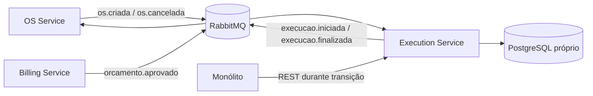

# Arquitetura do Execution Service

## Contexto

O OS Service continua como dono do estado canônico da ordem de serviço. O Billing Service é dono de orçamento e pagamento. O Execution Service é dono da fila, dos tempos e do progresso do trabalho da oficina.

## Decisões

- Saga coreografada para evitar um novo orquestrador central.
- PostgreSQL exclusivo, sem NoSQL.
- RabbitMQ para integração de domínio e REST somente para consulta/comando operacional.
- Chave única `os_id` e transições idempotentes para tolerar reentrega.
- DLQ por fila para impedir perda silenciosa de mensagens inválidas.
- Concorrência otimista pela coluna `version`.
- Monólito coexistente: delega operações e nunca consulta o banco deste serviço.

## Limites

Dados de cliente, veículo, catálogo, estoque, orçamento e pagamento permanecem somente como identificadores ou snapshots recebidos em eventos. Mudanças nesses domínios não são feitas por este serviço.

## Evolução prevista

1. Completar o fluxo de diagnóstico e atualização por item.
2. Adotar transactional outbox para publicação garantida.
3. Adicionar Testcontainers para PostgreSQL e RabbitMQ.
4. Propagar correlation/trace IDs nos eventos.
5. Criar dashboards, alertas e rastreamento distribuído.
